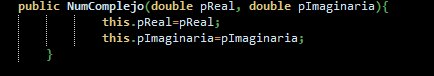
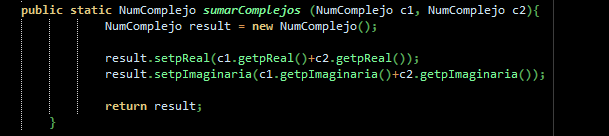
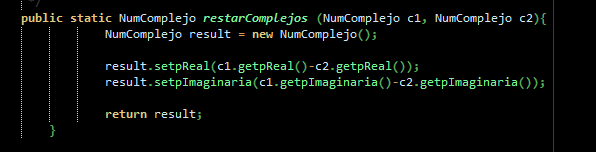
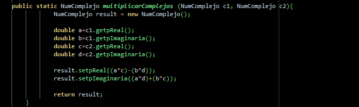
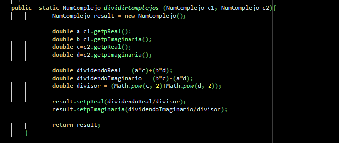
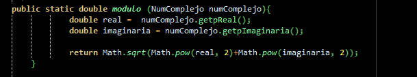

# Complejos

### Este programa se encarga de realizar operaciones de números complejos.

+ Sumar
+ Restar
+ Multiplicar
+ Dividir
+ Modulo

#### Constructor

Para ello hace uso de un constructor, al cual pasamos como argumentos la parte real y la parte imaginaria del número complejo y generará el número complejo.

#### Suma

Llamaremos al método pasandole como parámetros dos números complejos.

#### Resta

Llamaremos al método pasandole como parámetros dos números complejos.

#### Multiplicación

Llamaremos al método pasandole como parámetros dos números complejos.

#### División

Llamaremos al método pasandole como parámetros dos números complejos.

#### Modulo

Para realizar el módulo, llamaremos al método, pasando únicamente un número complejo como parámetro.

